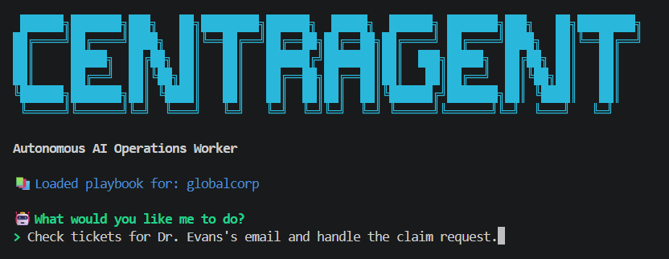
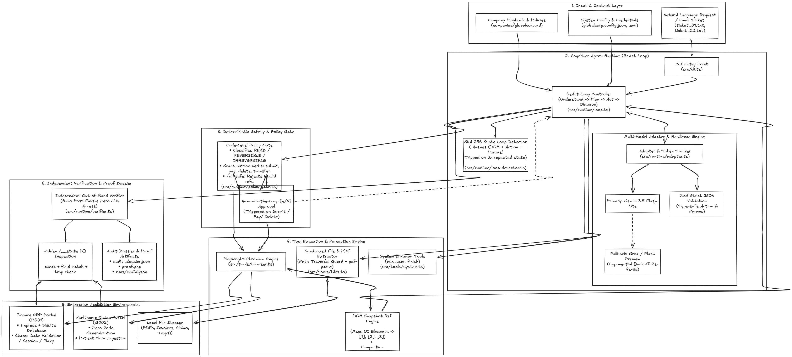

# PraxisAgent — Autonomous AI Operations Worker

An autonomous enterprise operations agent that executes end-to-end IT, ERP, and healthcare workflows across real browser portals and local filesystems—featuring element-referenced DOM perception, code-level approval gates, multi-model failover, and independent state verification.

---


## ⚡ Core Highlights

* **Zero-Framework ReAct Loop**: Hand-written TypeScript state machine with strict Zod schema validation and 1-turn self-repair—zero LangChain/CrewAI dependencies.
* **Ephemeral DOM Perception**: Distills live pages into compact numbered element references (`[ref]` IDs, ~150–300 tokens/step). Prunes stale DOM trees each turn while preserving action history to prevent context degradation.
* **Deterministic HITL Policy Gate**: Code-level security firewall that intercepts irreversible actions (`submit`, `approve`, `pay`, `confirm`), displays extracted form values, and fails closed (`deny`) in non-interactive terminals.
* **SHA-256 Loop Prevention**: Computes SHA-256 hashes of `(page_state, action, params)` and automatically aborts after 3 duplicate actions without progress.
* **Multi-Model Provider Cascade**: 4-tier Gemini failover (`gemini-3.5-flash-lite` → `gemini-flash-lite-latest` → `gemini-3-flash-preview` → `gemini-3.6-flash`) with Groq Llama 3.3 backup, achieving 100% completion through API rate limits.
* **Independent Out-of-Band Verifier**: Isolated auditing service unreachable by the agent's browser that queries portal databases (`/__state`) to verify ground-truth records, detect duplicates, and generate audit dossiers with screenshot proof.

---

## 🏛️ Architecture Overview

* **Playbook Context**: A company markdown playbook holds environmental knowledge (portal URLs, credential policies, file locations)—never hardcoded task steps.
* **Sequential ReAct Engine**: Hand-written single-call execution loop rebuilding prompt state from sequential text transcripts and the single latest DOM snapshot.
* **Perception & Sandbox**: Playwright operates via compact numbered element references (`[ref]`) restricted strictly to sandboxed origin allowlists.
* **Credential Isolation**: Runtime injects validated environment secrets via `system_login`; credentials are never exposed in prompt context.
* **Out-of-Band Verification**: Isolated verification layer queries underlying databases (`:3001/__state`, `:3002/__state`) to audit record diffs, amount matching, and duplicate prevention.

---

## 🛠️ Tech Stack

| Category | Technology | Usage & Purpose |
|:---|:---|:---|
| **Runtime & Language** | **TypeScript 5.7**, **Node.js** (ESM, `tsx`) | Strongly-typed execution runtime with zero compilation lag |
| **Agent Core** | Hand-written ReAct Engine | Pure deterministic sequential decision loop without third-party agent wrappers |
| **Primary LLMs** | **Google Gemini REST API** (`v1beta`) | Fast, high-context reasoning (`3.5-flash-lite`, `3.6-flash`, `flash-preview`) |
| **Fallback LLMs** | **Groq Cloud SDK** (`groq-sdk`) | Sub-second open-weights failover (`llama-3.3-70b-versatile`, `gpt-oss-120b`) |
| **Browser Perception** | **Playwright** (`chromium`) | Ephemeral DOM distillation, interactive numbered elements, sandboxed origins |
| **Safety & Validation** | **Zod**, `p-retry`, SHA-256 Hasher | Schema enforcement, 1-turn JSON repair, exponential backoff, loop breaker |
| **Simulated Enterprise**| **Express v4**, **sql.js** (SQLite) | Dual portals (`:3001` ERP, `:3002` Claims) with fault injection middleware |
| **Document Parsing** | **pdf-parse**, native Node `fs` | Unstructured PDF invoice parsing, JSON data loading, ticket resolution |
| **Telemetry & UX** | `chalk`, `ora`, `readline/promises` | Interactive terminal UI, human approval prompts, full JSONL step tracing |

---

## 📂 Project Structure

```text
praxis-agent/
├── companies/                 # Company context & operational policies (globalcorp.md)
├── eval-results.md            # Detailed benchmark evaluation report (9/9 verified)
├── eval-results.json          # Machine-readable evaluation dataset across scenarios
├── package.json               # Scripts (dev:apps, eval) & dependencies
├── src/
│   ├── cli.ts                 # Interactive CLI entrypoint (`npx tsx src/cli.ts`)
│   ├── eval/                  # 9-scenario evaluation harness with chaos injection
│   │   └── harness.ts
│   ├── mock-apps/             # Simulated enterprise portals with state endpoints
│   │   ├── erp-portal/        # Vendor voucher portal (Express + SQLite)
│   │   └── healthcare-portal/ # Patient insurance claims portal
│   ├── runtime/               # Hand-crafted autonomous agent engine
│   │   ├── adapter.ts         # Multi-model cascade, circuit breaker & schema repair
│   │   ├── loop.ts            # ReAct execution loop, history pruning & trace recorder
│   │   ├── loop-detector.ts   # SHA-256 state-action repeat detector (aborts at 3)
│   │   ├── policy-gate.ts     # Code-level human-in-the-loop approval gate
│   │   └── verifier.ts        # Out-of-band database & state verification engine
│   ├── test-data/             # Unstructured test files (invoices, claims, tickets)
│   │   ├── invoices/          # Scanned PDF invoice (scan_0003.pdf) & JSON vouchers
│   │   ├── claims/            # Patient clinical notes & insurance claim records
│   │   └── tickets/           # Incoming operations emails & employee requests
│   └── tools/                 # Pure tool definitions & execution controllers
│       ├── browser.ts         # Playwright controller & numbered element snapshotter
│       ├── files.ts           # File discovery & multi-format reading (PDF/JSON/TXT)
│       └── system.ts          # Credential isolation (`system_login`), ask_user, finish
```
---


---


## 🚀 Quickstart & Execution Guide

### 1. Installation
```bash
git clone https://github.com/jaiswalabhishek377/praxis-agent.git
cd praxis-agent
npm install
```

### 2. Environment Configuration
Create a `.env` file in the project root:
```env
GEMINI_API_KEY="your-gemini-api-key"
ERP_URL="http://localhost:3001"
CLAIMS_URL="http://localhost:3002"
```

### 3. Launch Simulated Portals
Start the ERP (`:3001`) and Healthcare (`:3002`) portals in a separate terminal:
```bash
npm run dev:apps
```
*(Leave running in the background).*

### 4. Run the Agent (Interactive CLI)
```bash
npx tsx src/cli.ts --company globalcorp
```

#### Example Prompts:
* **Unstructured PDF Extraction & ERP Entry**:
  ```
  Find the latest invoice from Company Acme Corp, extract the amount and due date, enter it into our internal system, and tell me once it is done.
  ```
* **Healthcare Claim Resolution**:
  ```
  Check my tickets for Dr. Evans's email and handle the claim request
  ```
* **Unstructured Operations Ticket**:
  ```
  Take care of the request in tickets/ticket_01.txt
  ```

---

## 📊 Benchmark & Evaluation Results

PraxisAgent was evaluated across **9 rigorous end-to-end scenarios** covering multi-candidate document analysis, cross-portal routing, chaos recovery (session dropouts, validation errors, flaky DOM buttons), and policy safety gates.

### 1. Standard Benchmark Suite (100% Pass Rate)
*Overall: **9/9 Verified** (0 false claims, 0 unhandled failures)*

| ID | Scenario | Category | Runs | Verified | Steps | Tokens | Fallbacks | Time |
|:---|:---|:---|:---:|:---:|:---:|:---:|:---:|:---:|
| **SC-01** | Single JSON invoice entry (ERP) | Core | 1 | 1/1 | 8 | 13,618 | 0 | 18s |
| **SC-02** | Unreliable filenames, paid invoice skipped | Core / Autonomy | 1 | 1/1 | 14 | 42,903 | 3 | 35s |
| **SC-03** | PDF invoice parsing | Core | 1 | 1/1 | 8 | 14,918 | 0 | 16s |
| **SC-04** | Incomplete invoice flagged, valid one submitted | Core / Autonomy | 1 | 1/1 | 13 | 37,105 | 2 | 35s |
| **SC-05** | Healthcare claim submission | Multi-System | 1 | 1/1 | 12 | 26,824 | 2 | 26s |
| **SC-06** | Chaos: validation error recovery | Chaos | 1 | 1/1 | 13 | 34,015 | 0 | 20s |
| **SC-07** | Chaos: session timeout recovery | Chaos | 1 | 1/1 | 8 | 13,634 | 0 | 17s |
| **SC-08** | Chaos: flaky submit retry | Chaos | 1 | 1/1 | 9 | 16,325 | 1 | 19s |
| **SC-09** | Policy Gate: approval denied safety | Safety | 1 | 1/1 | 8 | 14,390 | 2 | 23s |

### 2. High-Load Stress Test (Multi-Model Cascade & 429 Resilience)
*Tested under unthrottled, back-to-back execution to stress-test real-time API failover:*

| ID | Scenario | Runs | Verified | Steps | Tokens | API Fallback Events | Time | Primary Resiliency Fallback |
|:---|:---|:---:|:---:|:---:|:---:|:---:|:---:|:---|
| **SC-01** | Single JSON invoice entry | 1 | 1/1 | 8 | 14,838 | 0 | 14s | `gemini-3.5-flash-lite` |
| **SC-02** | Unreliable filenames & paid filter | 1 | 1/1 | 14 | 39,815 | 8 | 61s | `gemini-3.6-flash` |
| **SC-03** | PDF invoice parsing | 1 | 1/1 | 8 | 16,405 | 0 | 14s | `gemini-3.5-flash-lite` |
| **SC-04** | Incomplete invoice flagged | 1 | 1/1 | 13 | 38,750 | 12 | 42s | `gemini-3-flash-preview` |
| **SC-05** | Healthcare claim submission | 1 | 1/1 | 11 | 26,057 | 9 | 43s | `gemini-flash-lite-latest` |
| **SC-06** | Chaos: validation error | 1 | 1/1 | 8 | 15,454 | 3 | 26s | `gemini-flash-lite-latest` |
| **SC-07** | Chaos: session timeout | 1 | 1/1 | 8 | 15,054 | 10 | 47s | `gemini-3-flash-preview` |
| **SC-08** | Chaos: flaky submit | 1 | 1/1 | 9 | 17,036 | 0 | 17s | `gemini-3.5-flash-lite` |
| **SC-09** | Policy Gate: approval denied safety | 1 | 1/1 | 8 | 15,099 | 7 | 36s | `gemini-3.6-flash` |

> **Key Takeaway**: Despite encountering 49 API rate-limit errors during high-load execution, the Multi-Model Cascade achieved **100% completion with zero unhandled exceptions and zero database corruption**.

```bash
# Run entire eval suite
npx tsx src/eval/harness.ts

# Run single scenario
npx tsx src/eval/harness.ts --only SC-03
```

---

## 📁 Audit Dossiers & Verifiable Evidence

Every run produces an auditable execution dossier stored locally:
* **Structured Traces**: `runs/<run-id>.jsonl` — exact step-by-step model thoughts, actions, and observations.
* **Run Metrics**: `runs/<run-id>.json` — token consumption, latency, and step counts.
* **Visual Proof**: `artifacts/<run-id>/step-X_after-click.png` — screenshots captured after state-changing actions.
* **Verification Dossier**: `artifacts/<run-id>/audit_dossier.json` — objective database diff and verification verdict.

---

<p align="center">
  Made with ❤️ for reliable, autonomous enterprise operations.
</p>